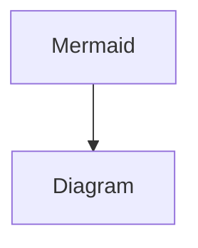
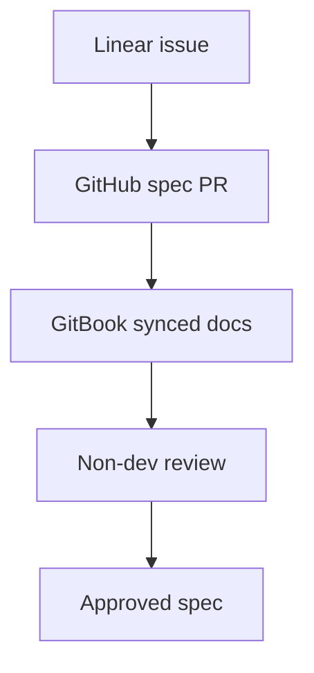

# Testing Page

This is a testing page\
\
We want to see how this works between github and gitbook

edited line\
\
\
test 2

Edited from Github

<figure><figcaption></figcaption></figure>

```mermaid
graph TD
  Mermaid --> Diagram
```

```mermaid
flowchart TD
  A[Linear issue] --> B[GitHub spec PR]
  B --> C[GitBook synced docs]
  C --> D[Non-dev review]
  D --> E[Approved spec]
```
